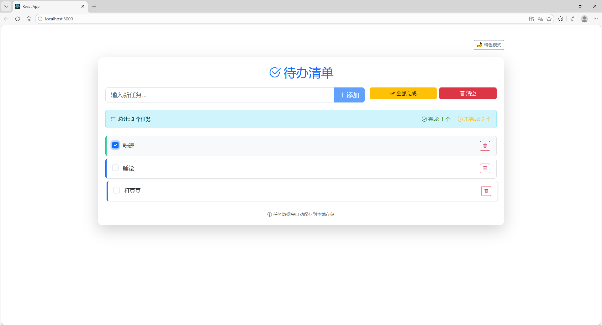
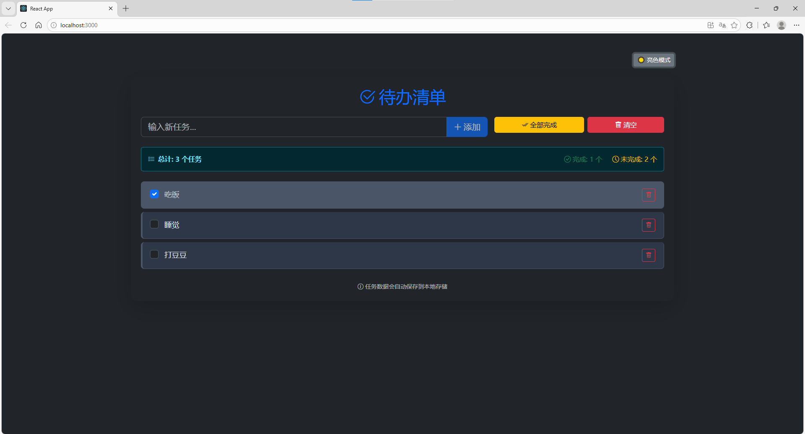
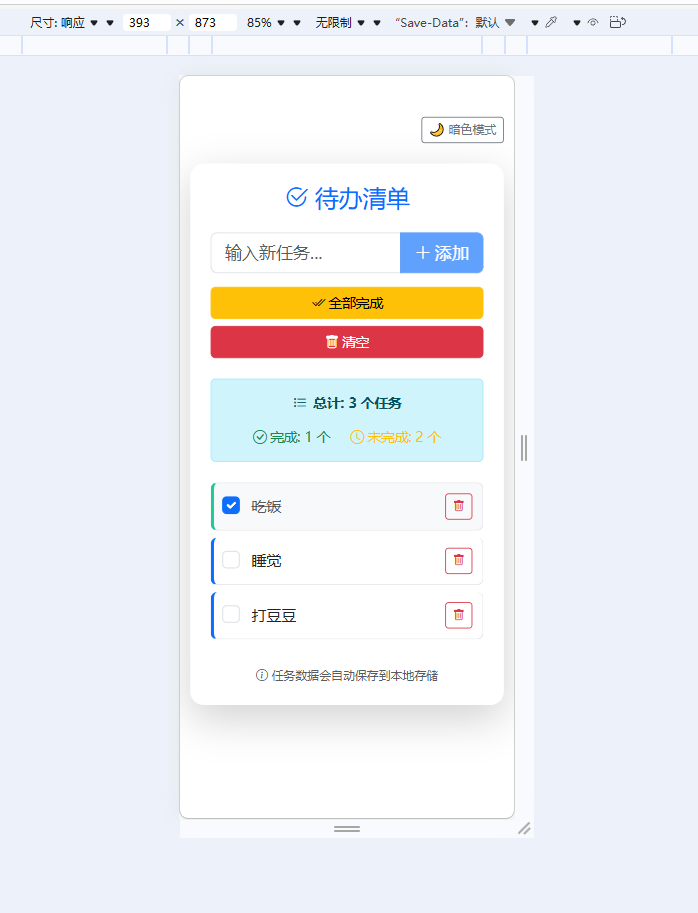
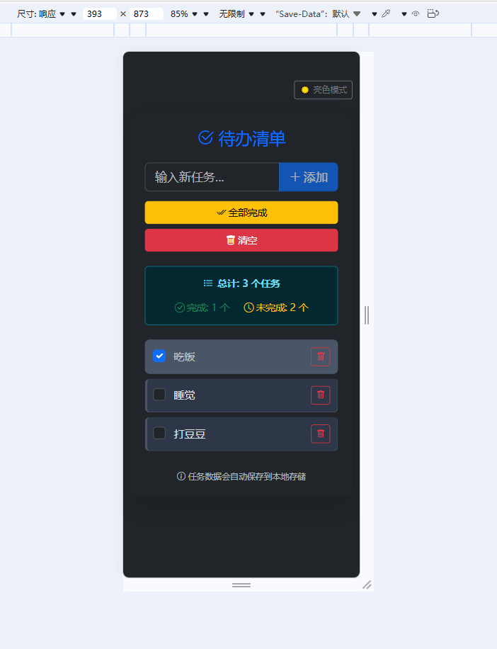

# 🎯 Todo List Pro - React 待办清单应用

一个功能完整的现代化待办事项应用，使用 React 和 Bootstrap 5 构建。

## ✨ 功能特性

- ✅ 添加/删除/标记完成任务
- ✅ 本地存储（刷新不丢失）
- ✅ 亮色/暗色主题切换
- ✅ 响应式设计（手机/平板/电脑）
- ✅ 任务统计（总计/完成/未完成）
- ✅ 全选/全不选功能
- ✅ 一键清空所有任务
- ✅ 键盘支持（回车添加任务）

## 🖼️ 截图预览

### PC端




### 手机端




## 🚀 在线演示

[点击这里查看在线演示](https://codeeeeeex.github.io/todolist-react)

## 🛠️ 技术栈

- **前端框架**: React 18
- **UI 库**: Bootstrap 5
- **状态管理**: React Hooks (useState, useEffect)
- **数据持久化**: LocalStorage API
- **部署**: GitHub Pages
- **图标**: Bootstrap Icons

## 📦 如何运行本项目

```bash
# 克隆项目
git clone https://github.com/codeeeeeex/todolist-react.git

# 进入目录
cd todo-list-react

# 安装依赖
npm install

# 启动开发服务器
npm start
```

## 📁 项目结构

```
todo-list-react/
├── public/          # 静态资源
├── src/
│   ├── components/  # React组件
│   │   └── TaskItem.jsx
│   ├── App.js       # 主组件
│   ├── App.css      # 自定义样式
│   └── index.js     # 入口文件
├── screenshots/     # 截图目录
├── README.md        # 项目说明
└── package.json     # 项目配置
```

## 🧠 学习收获

通过本项目，我深入理解了：

- React 状态管理（useState, useEffect）
- 组件化开发思想
- Bootstrap 5 响应式布局
- 本地存储 API 的应用
- 前端工程化部署流程
